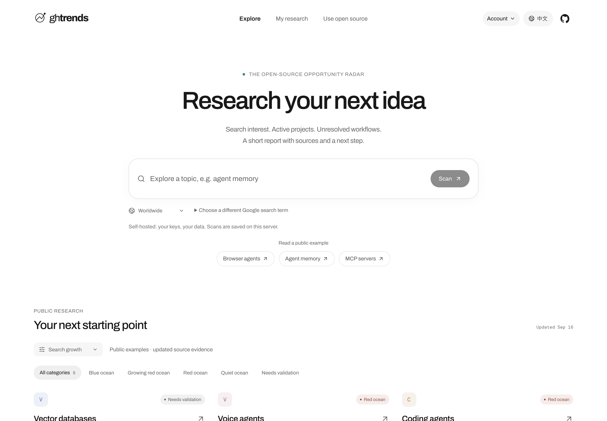

<div align="center">

# ghtrends ↗

**[English](README.md) · 简体中文**

### 看清机会，再开始做。

**GitHub 供给 × Google 搜索需求。**
发现增长中的赛道，了解竞争，分享有依据的判断。

[打开机会雷达](https://ghtrends.dev/radar/?lang=zh) · [判断方法](https://ghtrends.dev/radar/docs?lang=zh) · [反馈问题](https://github.com/noahbenjamin1994/ghtrends-radar/issues)

</div>

[](https://github.com/noahbenjamin1994/ghtrends-radar/actions/workflows/check.yml)

[](https://ghtrends.dev/radar/?lang=zh)

## 它能告诉你什么？

| 海域 | 搜索方向 | 匹配的活跃项目 | 起步策略 |
|---|---|---|---|
| 蓝海 | 上升 | 少于 50 个 | 验证尚未被充分服务的使用场景 |
| 增长红海 | 上升 | 至少 50 个 | 找到具体受众或独特优势 |
| 红海 | 平稳 / 下降 | 至少 50 个 | 找到用户愿意迁移的理由 |
| 静海 | 平稳 / 下降 | 少于 50 个 | 验证是早期、小众还是缺乏活力 |
| 待验证 | 信号分歧 / 证据不足 | 任意 | 检查已知事实，补充缺失证据 |

海域名称概括已观察到的搜索和开源信号，不代表已经证实真实商业竞争；静海仍可能是有价值的小众市场。

每份报告包含来源查询、采集日期、方法版本和适用范围。分类页与报告页在 JavaScript 加载前就包含可读证据正文。搜索关注度不能直接代表付费客户，象限分类用于决定下一步研究方向，不预测商业成功。

## 数据不足时，也给出下一步

系统不会为了给出确定答案，把零搜索量直接判成“死海”，或把少量仓库判成“蓝海”。报告会明确说明：

- **目前已知**：实际检索范围、已找到的项目、可用的搜索历史。
- **初步建议**：根据已有证据，建议先研究什么、验证什么。
- **下一步行动**：查看替代工具、验证具体用户问题、调整关键词后重新采集。

例如输入 `ai4s`，系统会识别为 **AI for Science**，分别查询 GitHub 的 `ai4science`、`ai-for-science`、`ai4s` 标签，再对返回项目去重；不完整的联合检索只报告已找到的下限。Google Trends 使用完整领域名称。旧的缩写报告保留原始数据，并提供一键重查入口。

扫描会显示来源进度，在项目详情补充完毕前先展示初步结果。用户扫描优先于定时刷新，仓库详情最多使用三个并发请求；数据源限流仍可能增加等待时间。自托管未填模型 Key 时使用内置主题映射；填入 DeepSeek Key 后启用输入标准化和简短研究报告。

## 60 秒开始使用

**直接打开网站：** [ghtrends.dev/radar/](https://ghtrends.dev/radar/?lang=zh)，公开报告无需注册即可浏览。

网站支持中英文，包括报告解释、Markdown 和 PNG 导出。首次访问跟随浏览器语言；右上角可切换并保存偏好，切换时保留当前页面。链接添加 `?lang=zh` 或 `?lang=en` 可指定语言。

**CLI、本地网页与 MCP：** 需要 Node.js 22.13 或更新版本。

无需全局安装：

```sh
npx --yes --package=https://ghtrends.dev/radar/ghtrends.tgz ghtrends ui
```

也可以安装到本机：

```sh
npm install -g https://github.com/noahbenjamin1994/ghtrends-radar/releases/download/v0.7.2/ghtrends-radar-0.7.2.tgz

ghtrends ui
ghtrends scan --topic ai4s --json
ghtrends repo facebook/react
ghtrends compare facebook/react vuejs/core --format md
```

发布包名是 **ghtrends-radar**，可执行命令是 **ghtrends**。npm 上现有的 `ghtrends` 属于另一个项目；本项目目前通过 GitHub Releases 分发。

## 一套分析引擎，三种使用方式

- **网页**：首屏搜索与公开案例；“我的研究”集中保存报告和收藏项目。在报告中选择 2–6 个仓库进行对比，按需展开全景图与详细方法。收藏项目在打开列表时刷新，目前不发送提醒。支持分享报告及导出 PNG、Markdown、JSON。
- **CLI**：扫描赛道、查看仓库、管理持久化关注清单、对比项目、生成报告。
- **MCP**：让智能体直接使用结构化 GitHub 与搜索需求证据。

```sh
ghtrends scan --topic agent-memory --keyword "ai agent memory" --geo US
ghtrends scan --topic mcp-servers --report findings.md
ghtrends watch add facebook/react
ghtrends watch list
ghtrends watch run
ghtrends watch remove facebook/react
ghtrends report --topic coding-agents --format md
ghtrends compare facebook/react vuejs/core sveltejs/svelte --format json
ghtrends collect
ghtrends ui --port 3721 --no-open
ghtrends mcp
```

`scan` 执行赛道扫描；`report` 将完整可用证据、主要项目、Issue 线索与限制整理为文档。`watch run` 执行一次刷新，可交给外部调度器定期运行。

### MCP 配置

先安装发布包，再加入客户端的 MCP 配置：

```json
{
  "mcpServers": {
    "ghtrends": {
      "command": "ghtrends",
      "args": ["mcp"]
    }
  }
}
```

提供 `ghtrends_scan`、`ghtrends_repo`、`ghtrends_compare`、`ghtrends_watch_list` 四个工具，使用 stdio 传输。

示例提问：**“比较智能体记忆赛道的活跃 GitHub 供给与搜索需求，给我判断依据、适用范围和下一步建议。”**

### 凭据与存储

未配置凭据时，可在 GitHub 未认证额度内查询公开数据。较大扫描可选择个人 Token 或自己的 GitHub App：

```sh
export GITHUB_TOKEN=your_token
# 或者：
export GITHUB_APP_ID=your_app_id
export GITHUB_INSTALLATION_ID=your_installation_id
export GITHUB_PRIVATE_KEY_PATH=/secure/path/github-app.pem
```

App 安装令牌会自动续签。只返回公开仓库，不要把凭据提交到仓库或暴露给浏览器。

- 发布包附带有日期的公开初始快照，首次启动即可浏览。快照保留来源日期，超过 14 天的证据会降级，刷新后重新判断。
- SQLite 默认放在 `~/.ghtrends`，可用 `GHTRENDS_DATA_DIR` 覆盖。
- 托管版历史和关注列表按账户存入 SQLite，跨设备可用；自托管 CLI、MCP 与网页共用本地工作区，完成的扫描显示在“我的研究”。
- `GOOGLE_TRENDS_PROXY` 可选，用于配置 Trends 采集的 HTTP 代理。
- Google Trends 网页端点并非官方稳定 API，可能限流或变更。采集失败会明确呈现；复用历史快照时保留原日期。
- 登录后的新报告默认私有，主动公开后才可分享；停止公开会撤回后续访问，已下载的副本无法收回。旧匿名报告仍公开，无法自动认领；可在报告页手动保存到“我的研究”。

支持可复现的数据导入：

```sh
ghtrends scan --topic mcp-servers --trends-file demand.json --json
```

`demand.json` 遵循 `src/core/types.ts` 中的 `DemandEvidence`：包含匹配的关键词与地区、原始 Trends 来源链接、采集时间、每周 0–100 观测值以及可选参考词数值。未完成周需标记。系统校验输入，不会把日数据或缺失周当作完整周数据。

## 托管版与自托管版

| 功能 | 托管版未登录 | 托管版已登录 | 自托管开源版 |
|---|---|---|---|
| 公开雷达、报告、需求线索、公开导出 | 可用 | 可用 | 可用 |
| 新扫描、未缓存仓库对比 | — | 可用，有每日额度 | 使用自己的数据源额度 |
| 历史与关注列表 | — | 按账户保存，跨设备可用 | 本地 SQLite 工作区 |
| 输入标准化、简报 | 阅读已公开简报 | 使用后端 DeepSeek Key | 可选填写自己的 Key |
| 私有报告、主动分享 | — | 支持 | 由自己的部署访问范围决定 |

**一套代码，两种运行模式。** 自托管不要求 Logto，也不要求外部数据库。托管版将账户与报告归属、历史、关注列表、会话、每日额度存入 SQLite，单实例配持久化目录。备份使用 SQLite 备份接口或停机复制，不能只复制运行中的主文件而忽略 WAL。

**升级与回滚：** 升级前备份 SQLite。0.3 之前的版本不校验私有报告归属，不能直接连接包含私有报告的新数据库；回滚旧版本前须恢复升级前的备份，并另行保留新数据库。

自托管可选 AI 配置（仅后端环境变量）：

```sh
export DEEPSEEK_API_KEY=your_deepseek_key
export DEEPSEEK_MODEL=deepseek-flash
ghtrends ui
```

模型生成一个 Trends 主词、最多两个同义表达，以及受约束的 GitHub 主题与短语。歧义缩写会要求选择含义；采集完成后，根据**实际证据**生成中英文简报，不计算或改写指标。必要的查询会发送给 DeepSeek、Google、GitHub，请勿输入秘密。简报失败时，已采集的报告仍可阅读。

`PUBLIC_URL` 支持子目录，例如 `https://example.com/radar`；同一安装包也支持本地根路径。反向代理需原样转发此前缀，并配置对应的 Logto 回调地址。

公开托管部署配置 `GHTRENDS_HOSTED=1`、HTTPS `PUBLIC_URL`、`LOGTO_ENDPOINT`、`LOGTO_APP_ID`、`LOGTO_APP_SECRET`，可通过 `GHTRENDS_DAILY_SCANS` 修改每日额度（默认 10）。Logto 选择 Traditional 应用，回调地址为 `${PUBLIC_URL}/auth/callback`。GitHub 与 DeepSeek 密钥放服务器 Secret，不能放入 `VITE_*` 或浏览器存储。登录使用 PKCE、nonce/state、签名令牌校验；浏览器只获得 HttpOnly、Secure 会话 Cookie，个人数据写入另做 CSRF 校验。

## 管理员

管理员入口位于账号菜单。“研究与传播”汇总报告阅读、分享、导出和开源入口点击，用户完成的扫描与后台定时刷新分开统计。行为次数不等于独立访客、安装量或实际 GitHub Star。这些计数不保存搜索内容和访客标识，尊重浏览器 Do Not Track，与运行日志使用同一保留期限；仅托管模式默认启用，可用 `GHTRENDS_ANALYTICS=0` 关闭。升级前没有采集的行为无法回补。

`/admin` 查看扫描记录、排队情况、数据源错误及耗时、GitHub 额度快照、用户概况，以及 DeepSeek 实际输入、输出和缓存 token。记录持久化，重启未完成的扫描标为中断。运行日志默认保留 30 天，可通过 `GHTRENDS_LOG_RETENTION_DAYS` 配置 1–365 天；已保存报告单独保留。管理接口不返回密钥、会话令牌或私有报告正文。

```sh
# 从 Logto 用户详情复制固定用户 ID（sub），以逗号分隔。
# 不能填用户名、邮箱或显示名，也不在代码里写死部署者账号。
export GHTRENDS_ADMIN_USER_IDS=your_logto_user_id,another_logto_user_id
```

修改部署环境变量后重启。托管模式默认没有管理员，服务器每次请求检查白名单。本地未接 Logto 时，工作区所有者有管理权限；此时服务应只监听本机，需要公开访问则开启托管鉴权。

消耗从升级接入记录时开始，此前消耗**未知**；失败响应未返回的用量也保持未知。可通过 `GHTRENDS_LLM_PRICING_JSON` 配置各模型的每百万 token 美元单价：`{"your-model":{"input":0.3,"cachedInput":0.006,"output":1.2}}`（仅示例，请核实当前价格）。可选 `offPeakMultiplier` 使用 DeepSeek 的 UTC 工作日 01:00–04:00 / 06:00–10:00 高峰规则；固定价格时不填。每次调用保存当时估价，不包含未知价格的请求，**不作为服务商账单**。[价格说明](https://api-docs.deepseek.com/quick_start/pricing/) · [用量字段](https://api-docs.deepseek.com/api/create-chat-completion/)。

## 判断方法

**供给：** 查询相关 GitHub 主题，以及仓库名称或描述中的短语；逐项列出实际检索式。仓库须未归档、不是 Fork、至少 5 Star，且 180 天内有提交。目前以 50 个符合条件的项目作为供给密集门槛。单主题采用搜索返回的数量，展示最多 100 个主要项目；多主题对返回项目去重，未完整枚举时给出下限。它不是全市场竞品普查，不包含所有无标签或闭源产品。

**搜索关注度（方法 1.2.0）：** 获取两年 Google Trends 数据。比较最近 8 个完整周与前 8 周的中位数，同时核对 4 周和 13 周变化。主词与同义词在同一地区、时间范围内独立归一化采集，避免热门词将小众词压成零。主词证据不足时，按原定顺序选择第一个可用同义词，并说明原因；不相加指数，也不按涨跌挑词。

- 最近 26 周连续、完整；更早的缺口不影响近期判断。最近 26 周至少 60% 非零，前期中位数至少为 3。
- 上升 / 下降：8 周变化至少 ±10%，重采样区间全部位于零的同侧，短期和较长周期没有超过 10% 的反向变化。
- 平稳：8 周变化不到 10%，4 周和 13 周变化均不到 20%。其他可用情况或近期可用同义词反向，标为**信号分歧**。
- 证据缺失、过旧、不连续、接近零或采集失败时保留 `uncertain`。只使用采集时已结束的周；同周冲突值阻止分类。重采样检查稳定性，不代表成功概率。

兼容字段 `fast` 仍表示更严格的 25% 突破诊断；页面方向与分类使用 `metrics.trend`。50 个仓库是依赖检索范围的经验门槛，**不能证明商业竞争激烈**；Google 搜索关注度**不等于客户需求增速**。每份报告展示原始词、来源日期及限制。

同比按相隔 52 周的日期匹配，不按行号错位比较。报告区分“近期回调但高于去年”与“近期回升但低于去年”，不据此断言季节性。移除未经校准的机会分（`score: null`），按实测搜索变化或更新时间排序；证据等级最高为中等，数据完整不能证明词义匹配或客户需求。旧报告保留原快照，并提示重新扫描。

**仓库证据：** 使用 GitHub 官方 Star 历史自然日期分桶、有限的近期 Issue 样本、人工维护者回复和返回的贡献者提交数。自然日期窗口不代表滚动 24 小时净增。页面会说明样本范围；开放 Issue 是研究线索，不等于已验证的市场缺口。

**可复现性：** 来源证据、分析时间和方法版本共同决定报告 ID。旧报告的原始数据不变，重新扫描会产生新快照。初步建议可根据已记录的事实改进措辞，不会改写旧证据。本地报告只在主动分享时对外提供。

## 开发与部署

```sh
git clone https://github.com/noahbenjamin1994/ghtrends-radar.git
cd ghtrends-radar
npm ci
npm run check
npm run build
npm test
npm start
```

前端采用 React + TypeScript + Vite；核心为 TypeScript、Express、SQLite、Commander 与官方 MCP SDK。单包结构，无需外部数据库；LLM Key 为可选增强。

```sh
docker build -t ghtrends .
docker run --rm -p 3721:3721 -v ghtrends-data:/app/data \
  -e HOST=0.0.0.0 ghtrends
```

公共部署设置 `GHTRENDS_HOSTED=1`，首页仅展示精选赛道；自定义扫描需登录，保存为个人报告。关键词变体分开存储，不会覆盖标准赛道。配置 `PUBLIC_URL`；按需启用 `GHTRENDS_AUTO_COLLECT=1`，根据来源采集时间每日刷新精选赛道。`TRUST_PROXY` 仅填写实际受信任的反向代理网络。公共扫描限频，用户任务优先于定时采集；重新解释报告不会推迟数据刷新。

## 参与贡献

欢迎提交有证据的主题映射、算法反例测试、真实采集失败记录、翻译与无障碍改进。发现判断问题时，请附原始来源链接和时间戳。提交前运行上述检查。

如果 ghtrends 帮你找到了值得做的方向，欢迎分享报告、给项目点 Star，方便下次找到它。

MIT 协议。与 GitHub 或 Google 无隶属关系。Google Trends 采集复用了现有 trendscout 项目的经验。
